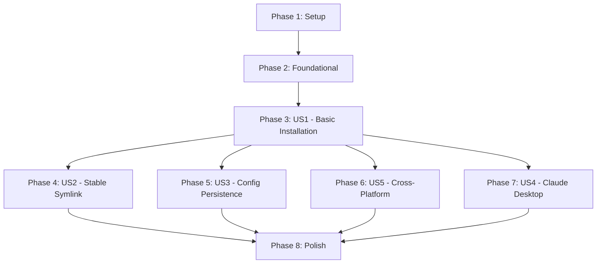

# Implementation Tasks: Claude Apps Integration

**Feature**: Claude Apps Integration\
**Branch**: `035-claude-apps-integration`\
**Generated**: 2026-01-01

## Task Summary

- **Total Tasks**: 18
- **Parallelizable**: 5
- **User Stories**: 5 active (US6 obsolete due to OAuth)
- **MVP Scope**: User Story 1 (Basic Installation)

## Implementation Strategy

**Approach**: Incremental delivery per user story

- Phase 1: Setup (project initialization)
- Phase 2: Foundational (blocking prerequisites)
- Phase 3: US1 - Basic Claude Code Installation (MVP)
- Phase 4: US2 - Stable Symlink for macOS
- Phase 5: US3 - Configuration Persistence
- Phase 6: US5 - Cross-Platform Support
- Phase 7: US4 - Optional Claude Desktop
- Phase 8: Polish & Documentation

**Note**: User Story 6 (Secret-Based Activation) is obsolete - Claude Pro uses OAuth authentication, no secret management needed.

______________________________________________________________________

## Phase 1: Setup

**Goal**: Initialize flake integration and project structure

### Tasks

- [x] T001 Add claude-code-nix flake input to flake.nix
- [x] T002 Update flake.lock with new input pin via nix flake lock
- [x] T003 Create system/shared/app/ai/ directory structure
- [x] T004 [P] Run nix flake check to validate flake syntax

**Completion Criteria**: Flake successfully includes claude-code-nix input, directory structure exists

______________________________________________________________________

## Phase 2: Foundational

**Goal**: Apply overlay to make claude-code package available system-wide

### Tasks

- [ ] T005 Apply claude-code-nix overlay in system/darwin/lib/darwin.nix
- [ ] T006 [P] Apply claude-code-nix overlay in system/nixos/lib/nixos.nix (if NixOS support exists)
- [ ] T007 Verify overlay application with nix flake show

**Completion Criteria**: Overlay applied in platform libraries, pkgs.claude-code is available

______________________________________________________________________

## Phase 3: User Story 1 - Basic Claude Code Installation (P1)

**Goal**: Users can install Claude Code by adding it to applications array

**Independent Test**: User adds "claude-code" to applications, runs `just install`, and can execute `claude --version`

### Tasks

- [ ] T008 [US1] Create system/shared/app/ai/claude-code.nix module with header documentation
- [ ] T009 [US1] Add home.packages = [ pkgs.claude-code ] to claude-code.nix
- [ ] T010 [US1] Add API key conflict warning using builtins.getEnv "ANTHROPIC_API_KEY"
- [ ] T011 [US1] Add shell alias for claude command in claude-code.nix
- [ ] T012 [US1] Test installation by adding claude-code to a test user's applications array
- [ ] T013 [US1] Verify claude command is available after installation

**Completion Criteria**: Claude Code installs successfully, `claude --version` works, API key conflict warning appears if ANTHROPIC_API_KEY is set

______________________________________________________________________

## Phase 4: User Story 2 - Stable Symlink for macOS (P2)

**Goal**: macOS users get persistent symlink that survives Nix updates

**Independent Test**: After Nix update, `~/.local/bin/claude` still works without new permission prompts

### Tasks

- [ ] T014 [US2] Add home.activation.createClaudeSymlink to claude-code.nix with lib.mkIf isDarwin
- [ ] T015 [US2] Create ~/.local/bin directory in activation script
- [ ] T016 [US2] Create symlink pointing to ${pkgs.claude-code}/bin/claude
- [ ] T017 [US2] Add ~/.local/bin to home.sessionPath with lib.mkIf isDarwin
- [ ] T018 [P] [US2] Test symlink creation on Darwin system
- [ ] T019 [P] [US2] Test symlink persistence after nix profile upgrade

**Completion Criteria**: Symlink exists at ~/.local/bin/claude on Darwin, PATH includes ~/.local/bin, permissions persist across updates

______________________________________________________________________

## Phase 5: User Story 3 - Configuration Persistence (P2)

**Goal**: User's Claude configuration and workspace data persist across Nix updates

**Independent Test**: User creates .claude.json, updates system, verifies file unchanged

### Tasks

- [ ] T020 [US3] Document in claude-code.nix header that ~/.claude/ is NOT managed by Nix
- [ ] T021 [US3] Add comment explaining Claude Code manages its own config files
- [ ] T022 [P] [US3] Test that .claude.json persists after just install
- [ ] T023 [P] [US3] Test that ~/.claude/ directory contents persist after rebuild

**Completion Criteria**: Configuration files are left alone by Nix, persist through updates

______________________________________________________________________

## Phase 6: User Story 5 - Cross-Platform Support (P2)

**Goal**: Same app module works on Darwin and NixOS without modifications

**Independent Test**: Module successfully installs on both Darwin and NixOS

### Tasks

- [ ] T024 [US5] Verify claude-code.nix uses lib.mkIf for platform-specific code only
- [ ] T025 [US5] Verify no hard-coded platform paths in shared/app/ai/claude-code.nix
- [ ] T026 [US5] Test build on Darwin: just build <user> <darwin-host>
- [ ] T027 [US5] Test build on NixOS: just build <user> <nixos-host> (if NixOS host exists)

**Completion Criteria**: Same module works on both platforms, no platform-specific code outside conditionals

______________________________________________________________________

## Phase 7: User Story 4 - Optional Claude Desktop (P3)

**Goal**: Users can optionally install Claude Desktop GUI application

**Independent Test**: User adds "claude-desktop" to applications, installs successfully

### Tasks

- [ ] T028 [US4] Create system/shared/app/ai/claude-desktop.nix module
- [ ] T029 [US4] Add homebrew.casks for Darwin in claude-desktop.nix
- [ ] T030 [US4] Add home.packages for NixOS in claude-desktop.nix
- [ ] T031 [US4] Add header documentation explaining desktop vs CLI
- [ ] T032 [P] [US4] Test installation with only claude-desktop in applications
- [ ] T033 [P] [US4] Test installation with both claude-code and claude-desktop

**Completion Criteria**: Claude Desktop installs independently or alongside CLI, no conflicts

______________________________________________________________________

## Phase 8: Polish & Documentation

**Goal**: Complete documentation and final validation

### Tasks

- [ ] T034 Update CLAUDE.md "Active Technologies" section with Feature 035
- [ ] T035 Update README.md with claude usage examples
- [ ] T036 Verify quickstart.md is accurate for OAuth flow
- [ ] T037 Run nix flake check for final validation
- [ ] T038 Test complete user workflow: add app → install → authenticate → use

**Completion Criteria**: All documentation updated, flake check passes, end-to-end workflow verified

______________________________________________________________________

## Dependencies



**Critical Path**: Setup → Foundational → US1 → Polish

**Parallel Opportunities**:

- US2, US3, US5, US4 can be worked on independently after US1 completes
- Testing tasks within each user story can run in parallel

______________________________________________________________________

## Parallel Execution Examples

### Within User Story 1

```bash
# After T011 completes, these can run concurrently:
T012 [US1] Test installation
T013 [US1] Verify claude command
```

### Within User Story 2

```bash
# After T017 completes, these can run concurrently:
T018 [US2] Test symlink creation on Darwin
T019 [US2] Test symlink persistence
```

### Across User Stories (after US1 complete)

```bash
# These entire user stories can proceed in parallel:
Phase 4: US2 (Stable Symlink)
Phase 5: US3 (Config Persistence)
Phase 6: US5 (Cross-Platform)
Phase 7: US4 (Claude Desktop)
```

______________________________________________________________________

## Task Execution Notes

### API Key Conflict Warning (T010)

Implementation approach:

```nix
warnings = lib.optional (builtins.getEnv "ANTHROPIC_API_KEY" != "")
  "WARNING: ANTHROPIC_API_KEY detected. Claude Pro users should NOT use API keys...";
```

### Stable Symlink (T014-T017)

Implementation approach:

```nix
home.activation.createClaudeSymlink = lib.mkIf isDarwin (
  lib.hm.dag.entryAfter ["writeBoundary"] ''
    mkdir -p "$HOME/.local/bin"
    ln -sf "${pkgs.claude-code}/bin/claude" "$HOME/.local/bin/claude"
  ''
);
home.sessionPath = lib.mkIf isDarwin [ "$HOME/.local/bin" ];
```

### Cross-Platform Conditional (T024)

Pattern:

```nix
let
  isDarwin = pkgs.stdenv.isDarwin;
in {
  # Darwin-specific code
  home.activation.example = lib.mkIf isDarwin ( ... );
  
  # NixOS-specific code
  programs.example = lib.mkIf (!isDarwin) { ... };
}
```

______________________________________________________________________

## Testing Checklist

### User Story 1 - Basic Installation

- [ ] `just build <user> <host>` succeeds
- [ ] `just install <user> <host>` completes
- [ ] `claude --version` displays version
- [ ] `which claude` shows installed path
- [ ] Warning appears if ANTHROPIC_API_KEY is set

### User Story 2 - Stable Symlink

- [ ] `ls -l ~/.local/bin/claude` shows symlink
- [ ] Symlink points to nix store path
- [ ] `echo $PATH` includes ~/.local/bin
- [ ] After `nix profile upgrade`, symlink still works
- [ ] No permission prompts after Nix update

### User Story 3 - Config Persistence

- [ ] Create `~/.claude.json` with test content
- [ ] Run `just install <user> <host>`
- [ ] Verify `~/.claude.json` unchanged
- [ ] Create test file in `~/.claude/`
- [ ] Rebuild system
- [ ] Verify test file still exists

### User Story 4 - Claude Desktop

- [ ] Installation with only claude-desktop succeeds
- [ ] Installation with both apps succeeds
- [ ] No file conflicts between CLI and desktop

### User Story 5 - Cross-Platform

- [ ] Build on Darwin succeeds
- [ ] Build on NixOS succeeds (if host available)
- [ ] Same module source works on both

______________________________________________________________________

## File Modifications

### New Files

- `flake.nix` (modified - add input)
- `system/shared/app/ai/claude-code.nix` (created)
- `system/shared/app/ai/claude-desktop.nix` (created)
- `system/darwin/lib/darwin.nix` (modified - add overlay)
- `system/nixos/lib/nixos.nix` (modified - add overlay, if exists)

### Modified Files

- `CLAUDE.md` (add to Active Technologies)
- `README.md` (add usage examples)

### No Changes (user configuration)

- `user/<username>/default.nix` (users modify this themselves)

______________________________________________________________________

## Definition of Done

- [ ] All 38 tasks completed and checked off
- [ ] `nix flake check` passes
- [ ] End-to-end workflow tested: install → authenticate → use
- [ ] Documentation updated (CLAUDE.md, README.md)
- [ ] Cross-platform support verified on Darwin (minimum)
- [ ] No constitutional violations (\<200 lines per module)
- [ ] Code follows repository conventions
- [ ] Feature branch merged to main

______________________________________________________________________

## Notes

**Obsolete User Story**: US6 (Secret-Based Activation) was in original spec but is now obsolete because Claude Pro uses OAuth authentication. No secret management tasks needed.

**OAuth Authentication**: First-run authentication happens at runtime via browser, not during Nix build/install. Users run `claude` and select option 1 (Claude account with subscription).

**Constitutional Compliance**: Each app module must be \<200 lines. Use header comments to document purpose, dependencies, and platform support.

**Discovery System**: App modules in `system/shared/app/ai/` are automatically discovered when users add app names to their applications array. No manual imports needed.
